函数与方程
====
考试简介
----

<cr type="player" parameters="XMzg0NjU0Nzg4OA=="><notice>播放器功能在此无法正常显示，请移步至[程谱 coderecipe.cn](https://coderecipe.cn/learn/1)查看。</notice></cr>
所有视频密码：LKY1961

函数基本定义
----
<cr type="player" parameters="XMzg0NjU5MzI5Ng=="><notice>播放器功能在此无法正常显示，请移步至[程谱 coderecipe.cn](https://coderecipe.cn/learn/1)查看。</notice></cr>
什么是函数？这节课我们讲解一些函数的基本定义，比如定义域，值域等。这些都是用来分析函数的工具。
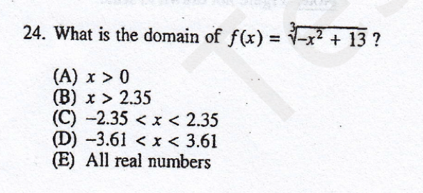

<cr type="hidden" parameters="点击查看答案"><notice>隐藏内容功能在此无法正常显示，请移步至[程谱 coderecipe.cn](https://coderecipe.cn/learn/1)查看。</notice>B，正答率66%</cr>

一次函数
----
<cr type="player" parameters="XMzg0NjU5Mzk1Ng=="><notice>播放器功能在此无法正常显示，请移步至[程谱 coderecipe.cn](https://coderecipe.cn/learn/1)查看。</notice></cr>
一次函数是最简单的函数之一，这节课我们讲解它的性质。
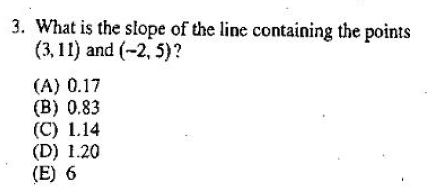

<cr type="hidden" parameters="点击查看答案"><notice>隐藏内容功能在此无法正常显示，请移步至[程谱 coderecipe.cn](https://coderecipe.cn/learn/1)查看。</notice>D，90</cr>

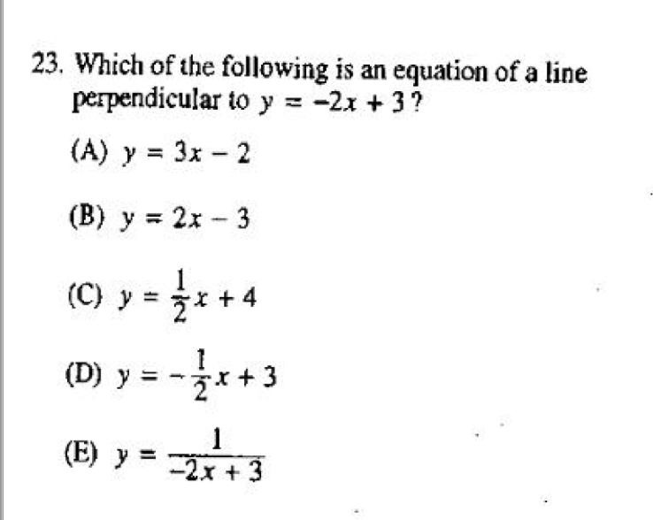

<cr type="hidden" parameters="点击查看答案"><notice>隐藏内容功能在此无法正常显示，请移步至[程谱 coderecipe.cn](https://coderecipe.cn/learn/1)查看。</notice>C，70</cr>

二次函数
----
<cr type="player" parameters="XMzg0NjU5NDMxMg=="><notice>播放器功能在此无法正常显示，请移步至[程谱 coderecipe.cn](https://coderecipe.cn/learn/1)查看。</notice></cr>
很多同学都在初中接触过二次函数，这节课主要是帮助大家回忆起初中的内容。

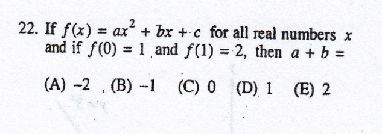

<cr type="hidden" parameters="点击查看答案"><notice>隐藏内容功能在此无法正常显示，请移步至[程谱 coderecipe.cn](https://coderecipe.cn/learn/1)查看。</notice>D，79</cr>

高次函数
----
<cr type="player" parameters="XMzg0NjU5NjIyMA=="><notice>播放器功能在此无法正常显示，请移步至[程谱 coderecipe.cn](https://coderecipe.cn/learn/1)查看。</notice></cr>
高次函数，比如三次，四次函数也有一些有趣的性质。

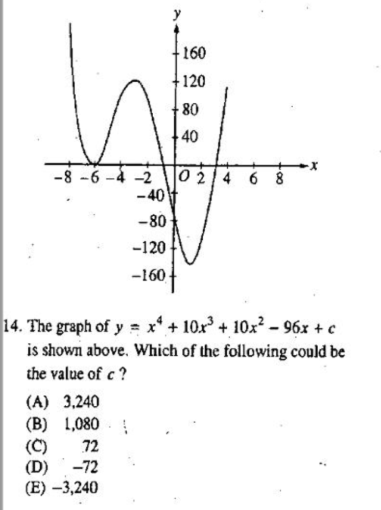

<cr type="hidden" parameters="点击查看答案"><notice>隐藏内容功能在此无法正常显示，请移步至[程谱 coderecipe.cn](https://coderecipe.cn/learn/1)查看。</notice>D，75</cr>

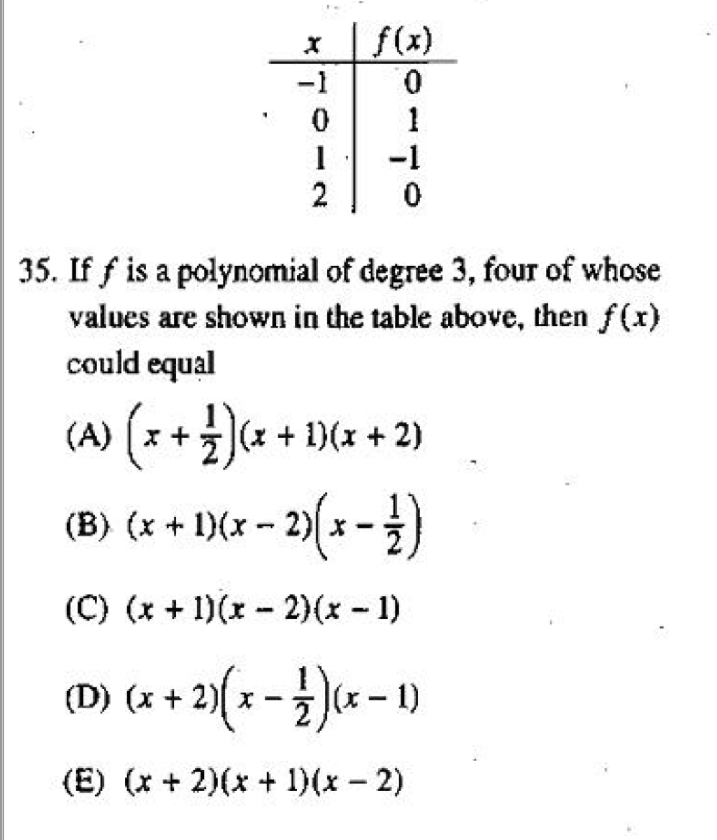

<cr type="hidden" parameters="点击查看答案"><notice>隐藏内容功能在此无法正常显示，请移步至[程谱 coderecipe.cn](https://coderecipe.cn/learn/1)查看。</notice>B，57</cr>

三角函数
----
<cr type="player" parameters="XMzg0NjU5Nzk4NA=="><notice>播放器功能在此无法正常显示，请移步至[程谱 coderecipe.cn](https://coderecipe.cn/learn/1)查看。</notice></cr>
第一讲主要讲解三角函数的定义以及三角关系，第二讲主要讲解三角函数作为函数的性质，比如定义域，值域，单调区间。

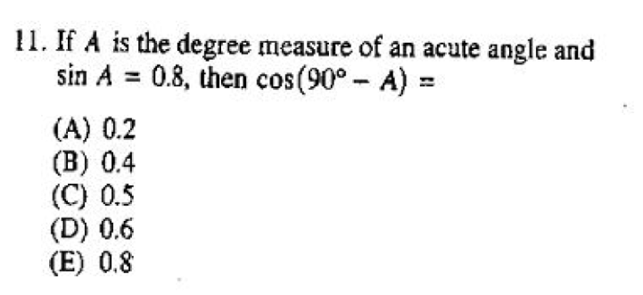

<cr type="hidden" parameters="点击查看答案"><notice>隐藏内容功能在此无法正常显示，请移步至[程谱 coderecipe.cn](https://coderecipe.cn/learn/1)查看。</notice>E，84</cr>

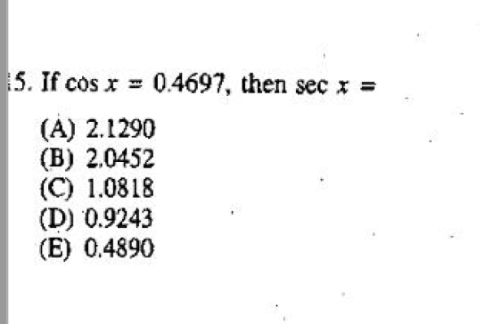

<cr type="hidden" parameters="点击查看答案"><notice>隐藏内容功能在此无法正常显示，请移步至[程谱 coderecipe.cn](https://coderecipe.cn/learn/1)查看。</notice>A，88</cr>

指数，对数函数
----
<cr type="player" parameters="XMzg0NjYwMTEwMA=="><notice>播放器功能在此无法正常显示，请移步至[程谱 coderecipe.cn](https://coderecipe.cn/learn/1)查看。</notice></cr>
指数函数是增长最快的函数之一，而对数是指数的逆运算。这两种函数之间有着千丝万缕的联系。

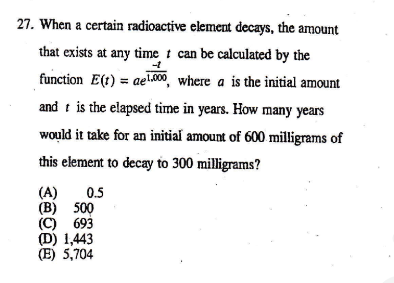

<cr type="hidden" parameters="点击查看答案"><notice>隐藏内容功能在此无法正常显示，请移步至[程谱 coderecipe.cn](https://coderecipe.cn/learn/1)查看。</notice>C，57</cr>

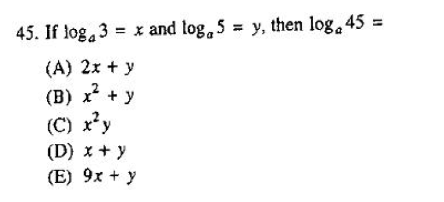

<cr type="hidden" parameters="点击查看答案"><notice>隐藏内容功能在此无法正常显示，请移步至[程谱 coderecipe.cn](https://coderecipe.cn/learn/1)查看。</notice>A，46</cr>

极限
----
<cr type="player" parameters="XMzg0NjYwNTk3Ng=="><notice>播放器功能在此无法正常显示，请移步至[程谱 coderecipe.cn](https://coderecipe.cn/learn/1)查看。</notice></cr>
极限是微积分的一个入门概念，属于SAT2中比较难的知识点，但是考的也相对简单。

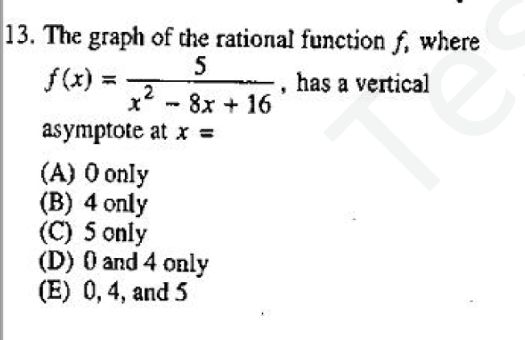

<cr type="hidden" parameters="点击查看答案"><notice>隐藏内容功能在此无法正常显示，请移步至[程谱 coderecipe.cn](https://coderecipe.cn/learn/1)查看。</notice>B，87</cr>

参数方程，分段函数，复合函数，反函数，函数图像变换
----
<cr type="player" parameters="XMzg0NjYwNzM2OA=="><notice>播放器功能在此无法正常显示，请移步至[程谱 coderecipe.cn](https://coderecipe.cn/learn/1)查看。</notice></cr>
这里是有一些函数章节剩余的知识点，比较简单。

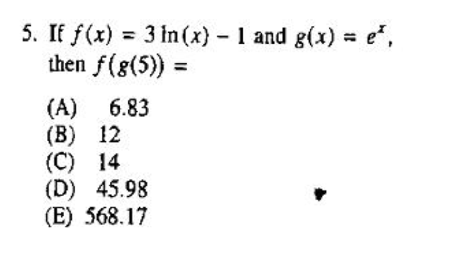

<cr type="hidden" parameters="点击查看答案"><notice>隐藏内容功能在此无法正常显示，请移步至[程谱 coderecipe.cn](https://coderecipe.cn/learn/1)查看。</notice>C，90</cr>

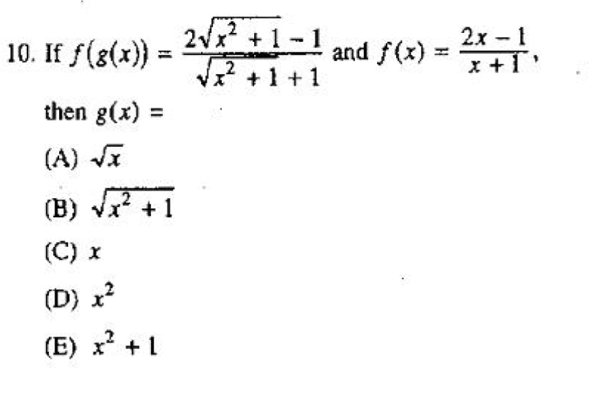

<cr type="hidden" parameters="点击查看答案"><notice>隐藏内容功能在此无法正常显示，请移步至[程谱 coderecipe.cn](https://coderecipe.cn/learn/1)查看。</notice>B，89</cr>

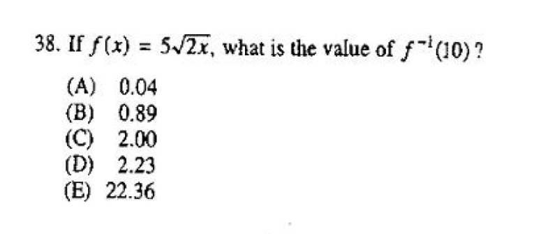

<cr type="hidden" parameters="点击查看答案"><notice>隐藏内容功能在此无法正常显示，请移步至[程谱 coderecipe.cn](https://coderecipe.cn/learn/1)查看。</notice>C，52</cr>

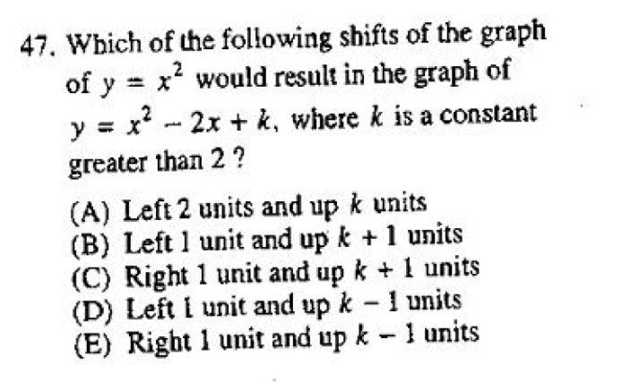

<cr type="hidden" parameters="点击查看答案"><notice>隐藏内容功能在此无法正常显示，请移步至[程谱 coderecipe.cn](https://coderecipe.cn/learn/1)查看。</notice>E，44</cr>

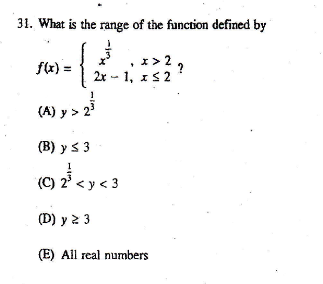

<cr type="hidden" parameters="点击查看答案"><notice>隐藏内容功能在此无法正常显示，请移步至[程谱 coderecipe.cn](https://coderecipe.cn/learn/1)查看。</notice>E，48</cr>

不等式
----
<cr type="player" parameters="XMzg0NjY1MjM3Ng=="><notice>播放器功能在此无法正常显示，请移步至[程谱 coderecipe.cn](https://coderecipe.cn/learn/1)查看。</notice></cr>
这里主要介绍不等式的性质，一元一次不等式和一元二次不等式。

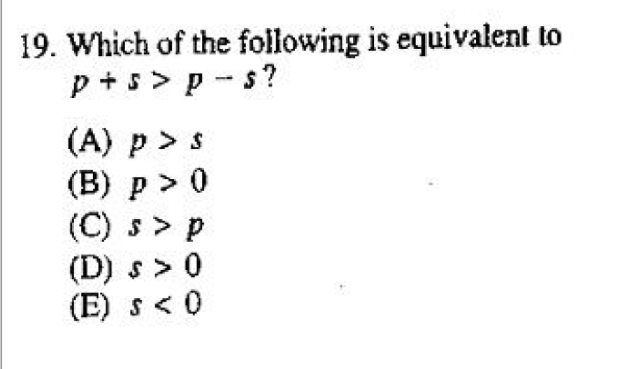

<cr type="hidden" parameters="点击查看答案"><notice>隐藏内容功能在此无法正常显示，请移步至[程谱 coderecipe.cn](https://coderecipe.cn/learn/1)查看。</notice>D，76</cr>

