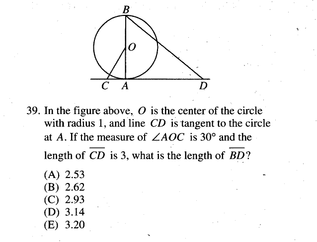
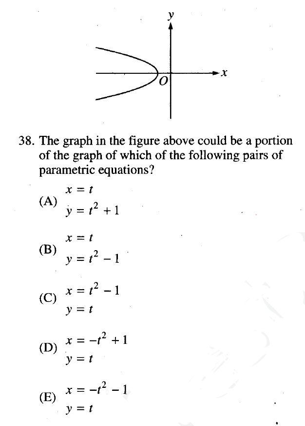
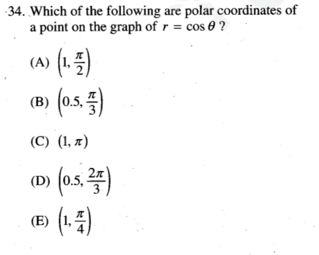
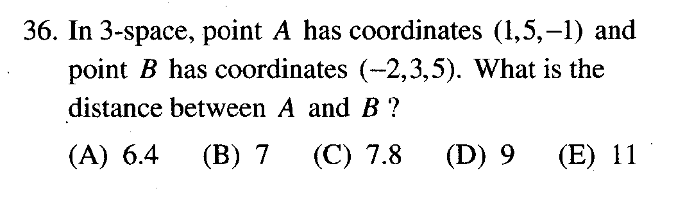

坐标几何（解析几何）
====
圆锥曲线
----
<cr type="player" parameters="XMzg0Nzg0MTkzNg=="><notice>播放器功能在此无法正常显示，请移步至[程谱 coderecipe.cn](https://coderecipe.cn/learn/1)查看。</notice></cr>
圆锥曲线是用一个平面去截圆锥所得到的曲线的总称，包括圆，椭圆，抛物线，和双曲线。SAT2对这个考点的考察很浅。
密码：LKY1961

<cr type="hidden" parameters="点击查看答案"><notice>隐藏内容功能在此无法正常显示，请移步至[程谱 coderecipe.cn](https://coderecipe.cn/learn/1)查看。</notice>D，65</cr>

<cr type="hidden" parameters="点击查看答案"><notice>隐藏内容功能在此无法正常显示，请移步至[程谱 coderecipe.cn](https://coderecipe.cn/learn/1)查看。</notice>E，47</cr>

极坐标和空间直角坐标系
<cr type="player" parameters="XMzg0ODgyNjkyOA=="><notice>播放器功能在此无法正常显示，请移步至[程谱 coderecipe.cn](https://coderecipe.cn/learn/1)查看。</notice></cr>
极坐标是和直角坐标对应的另一种坐标系，用来表示圆非常方便。空间直角坐标系是平面直角坐标系在三维空间中的延伸。
密码：LKY1961

<cr type="hidden" parameters="点击查看答案"><notice>隐藏内容功能在此无法正常显示，请移步至[程谱 coderecipe.cn](https://coderecipe.cn/learn/1)查看。</notice>B，45</cr>

<cr type="hidden" parameters="点击查看答案"><notice>隐藏内容功能在此无法正常显示，请移步至[程谱 coderecipe.cn](https://coderecipe.cn/learn/1)查看。</notice>B，67</cr>
