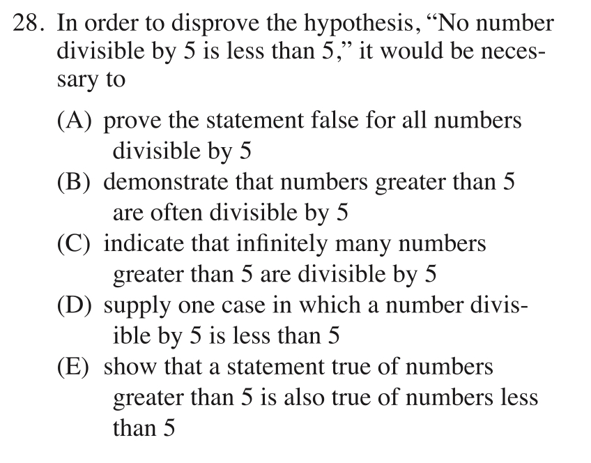
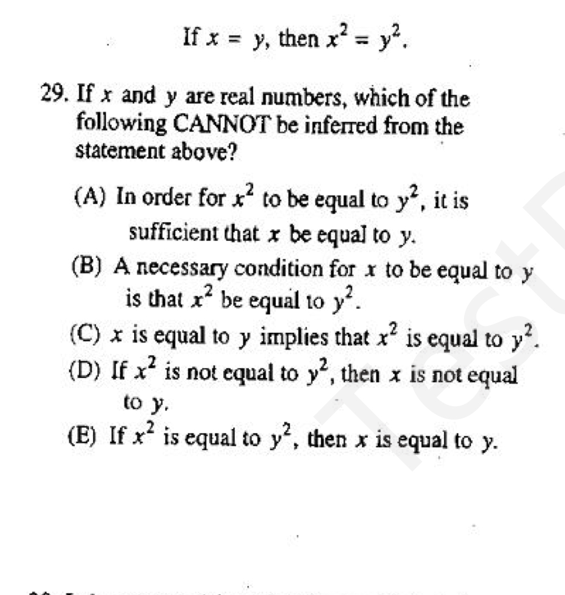
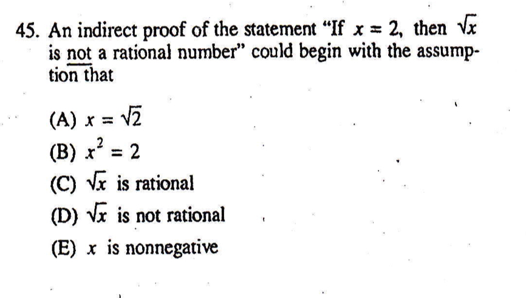

基本逻辑
====
基本逻辑
----
<cr type="player" parameters="XMzg5MTI4ODc2MA=="><notice>播放器功能在此无法正常显示，请移步至[程谱 coderecipe.cn](https://coderecipe.cn/learn/1)查看。</notice></cr>
我们日常生活中总会用到逻辑，这里SAT 2 考察的是一些基本的逻辑关系。
密码：LKY1961

D

C

C

