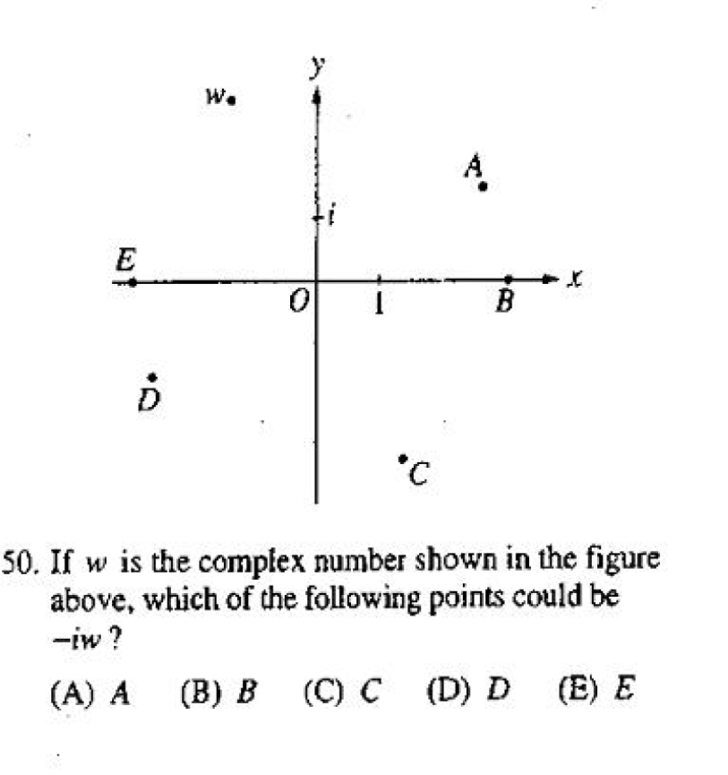

数与运算
====
排列组合
----
<cr type="player" parameters="XMzg1ODc1NjQ2NA=="><notice>播放器功能在此无法正常显示，请移步至[程谱 coderecipe.cn](https://coderecipe.cn/learn/1)查看。</notice></cr>
密码：LKY1961
排列组合给我们提供了一种解决复杂“数数”问题的工具。

B

A

复数
----
<cr type="player" parameters="XMzg1ODc5NjQ4OA=="><notice>播放器功能在此无法正常显示，请移步至[程谱 coderecipe.cn](https://coderecipe.cn/learn/1)查看。</notice></cr>
复数是在实数的基础上对“数”的概念的一次扩充。复数在数学上有着广泛的应用，其中一个应用就是表示∆<0的一元二次方程的解。

A，26

B，51

矩阵和行列式
----
矩阵和行列式是线性代数中的基础概念，线性代数在很多领域中都有重要的应用，最常见的比如CG特效（computer graphics）
<cr type="player" parameters="XMzg2NDczNzgyOA=="><notice>播放器功能在此无法正常显示，请移步至[程谱 coderecipe.cn](https://coderecipe.cn/learn/1)查看。</notice></cr>

D

C

数列
----
<cr type="player" parameters="XMzg4MDg2NTAwOA=="><notice>播放器功能在此无法正常显示，请移步至[程谱 coderecipe.cn](https://coderecipe.cn/learn/1)查看。</notice></cr>
一列有序的数组成一个数列，这里我们主要讲解等差数列和等比数列这两种特殊的数列

E

D

向量
----
<cr type="player" parameters="XMzg4MDg2NTg2OA=="><notice>播放器功能在此无法正常显示，请移步至[程谱 coderecipe.cn](https://coderecipe.cn/learn/1)查看。</notice></cr>
向量是一种有方向的“数”，在很多数学领域都有广泛的应用，这里介绍向量的一些基本知识点。

B

B

