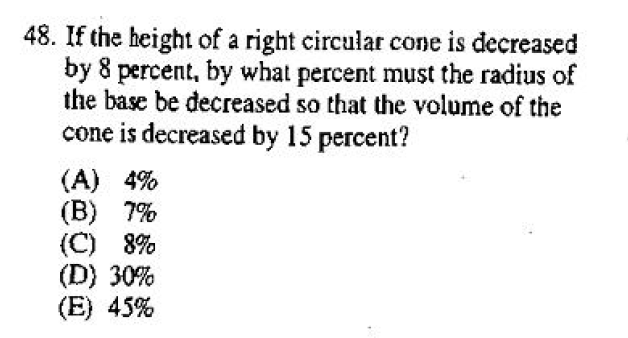
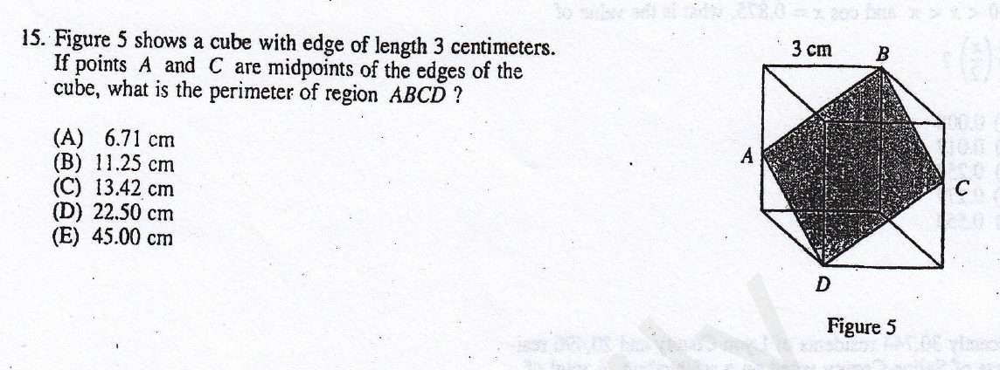

立体几何
====
立体几何
----
<cr type="player" parameters="XMzg1NTAzMjAzNg=="><notice>播放器功能在此无法正常显示，请移步至[程谱 coderecipe.cn](https://coderecipe.cn/learn/1)查看。</notice></cr>
密码：LKY1961
SAT II涉及的立体几何主要是求体积和表面积，也会涉及一些长度的运算。

<cr type="hidden" parameters="点击查看答案"><notice>隐藏内容功能在此无法正常显示，请移步至[程谱 coderecipe.cn](https://coderecipe.cn/learn/1)查看。</notice>A，35</cr>

<cr type="hidden" parameters="点击查看答案"><notice>隐藏内容功能在此无法正常显示，请移步至[程谱 coderecipe.cn](https://coderecipe.cn/learn/1)查看。</notice>C，71</cr>
