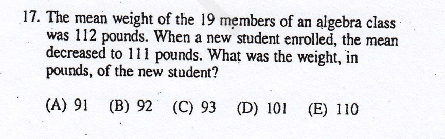
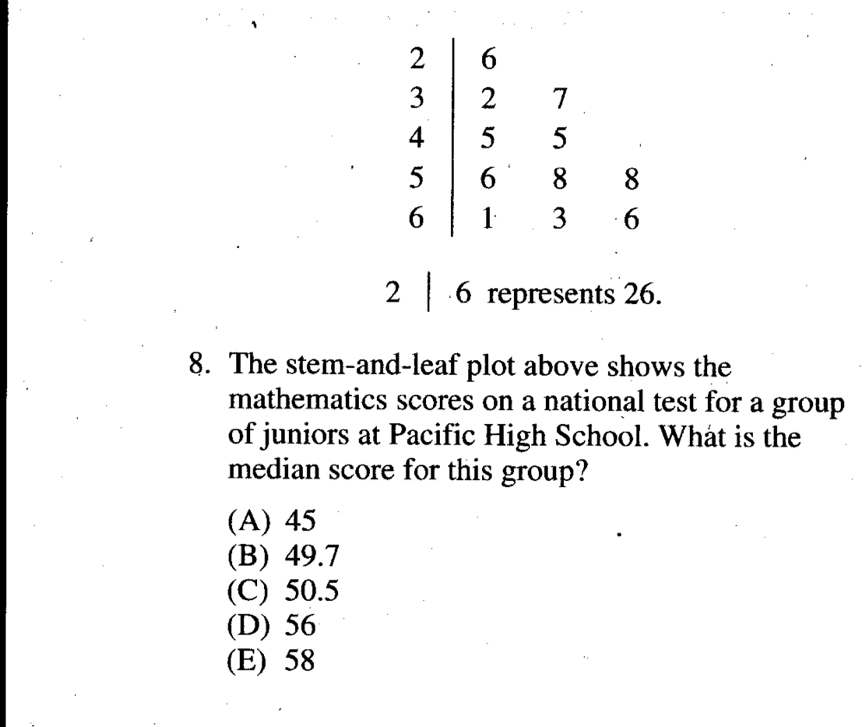
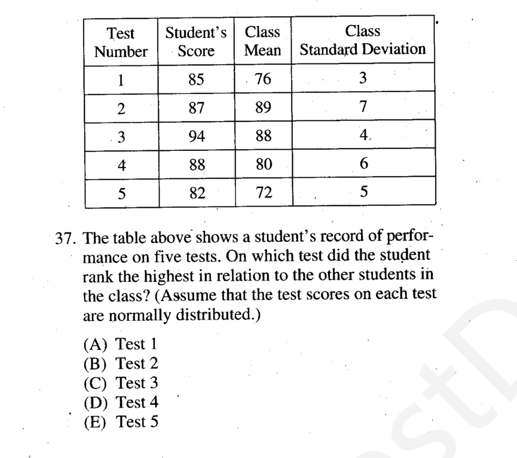
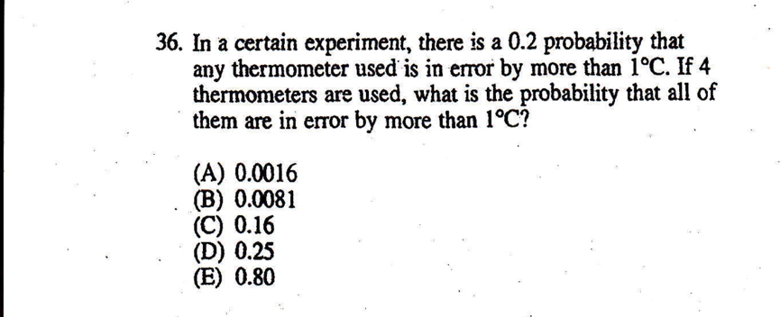
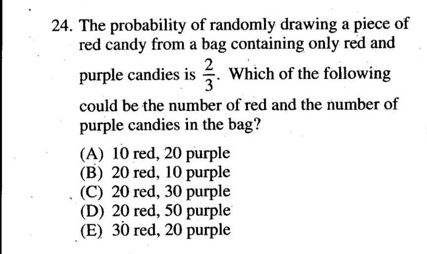
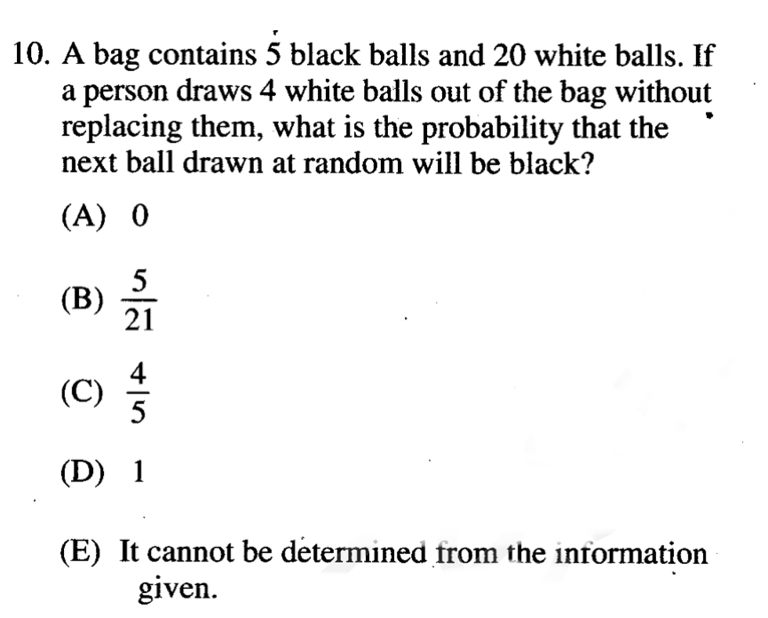

数据分析
====
数据分析
----
<cr type="player" parameters="XMzg4Mjk3ODM5Mg=="><notice>播放器功能在此无法正常显示，请移步至[程谱 coderecipe.cn](https://coderecipe.cn/learn/1)查看。</notice></cr>
密码：LKY1961
SAT2考察的是数据分析的一些基本维度，比如平均数，中位数，标准差等等。

B

D

A

概率
----
<cr type="player" parameters="XMzg5MDA4MDA1Mg=="><notice>播放器功能在此无法正常显示，请移步至[程谱 coderecipe.cn](https://coderecipe.cn/learn/1)查看。</notice></cr>
概率衡量的是一个事件或多个时间发生的可能性。SAT2考察的只是很基础的概率，一般用枚举法就可以解决。

A

B

B

